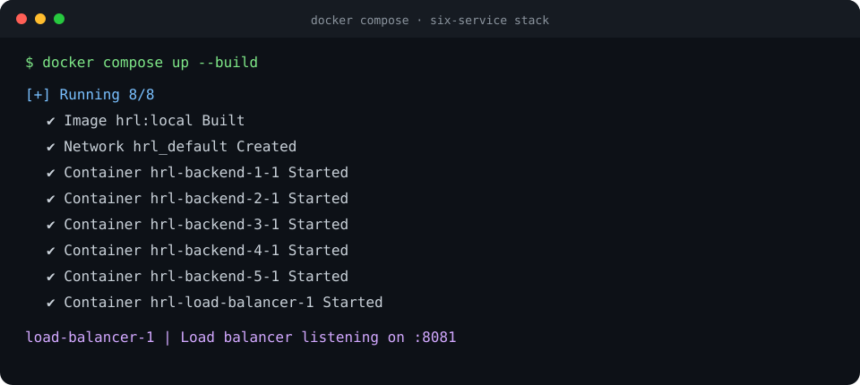
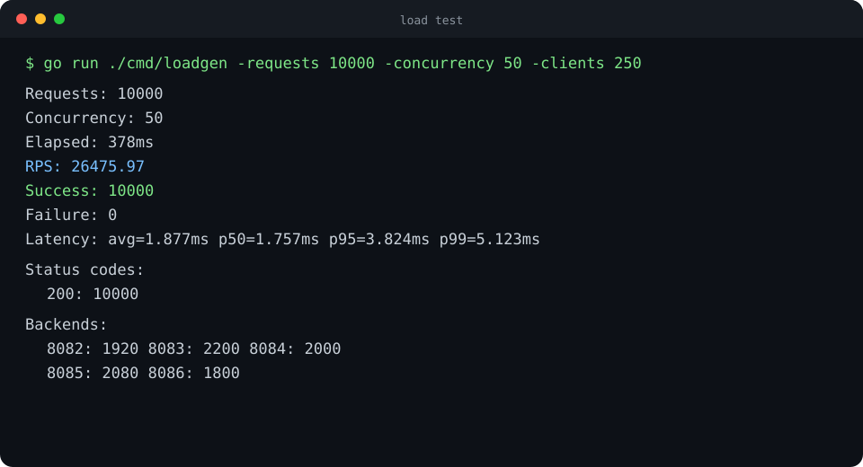

# Go Layer-7 Load Balancer

A standard-library HTTP reverse proxy with health-aware routing, concurrent backend state, and one-time transport failover.

> Sustained **26.5K requests/second** under concurrent local load testing with **5.15 ms P99 latency** and **zero failures** across five backends.

## Features

- Round Robin, Least Connections, and  IP Hash routing
- Active health checks every five seconds
- Three-failure threshold before removing a backend
- Automatic recovery and re-entry into rotation
- One retry on a different healthy backend after a transport failure

- Atomic health and connection state

- Built-in concurrent load generator with latency percentiles

The executable currently uses IP Hash. Round Robin and Least Connections are also implemented. On a transport failure, the proxy excludes the failed backend and retries  once on another healthy backend. 
## Run

Start the load balancer and its five local backends:

```bash
go run .
```

The proxy listens on `localhost:8081`; backends listen on ports `8082` through `8086`.

Inspect the selected backend:

```bash
curl -i http://localhost:8081/
```

## Run with Docker

Build and start the load balancer plus five isolated backend containers:

```bash
docker compose up --build
```


Run the load generator

```bash
curl -i http://localhost:8081/
go run ./cmd/loadgen -requests 10000 -concurrency 50 -clients 250
```

Take down containers

```bash
docker compose down
```
### Representative Docker Desktop result
## Load Test

The repository includes a concurrent Go load generator in `cmd/loadgen`. It uses a fixed worker pool and simulated client IPs to measure throughput, latency percentiles, status codes, failures, and traffic distribution.

With the load balancer running in another terminal:

```bash
go run ./cmd/loadgen -requests 10000 -concurrency 50 -clients 250
```

The generator reports attempted RPS, successful and failed requests, average latency, status codes, and per-backend request counts.

### Load-test screenshot



### Representative local result

| Metric | Result |
|---|---:|
| Requests | 10,000 |
| Concurrency | 50 |
| Median throughput | 26,476 RPS |
| Average latency | 1.88 ms |
| P95 latency | 3.87 ms |
| P99 latency | 5.15 ms |
| Success rate | 100% |


## Simulate Failure and Recovery

Make a backend fail health checks:

```bash
curl -i http://localhost:8083/fail
```

After three failed health checks, it is removed from routing. Restore it with:

```bash
curl -i http://localhost:8083/reverse
```

The next successful health check returns it to rotation. To test request-time retry, use a real transport failure such as an unreachable backend; `/fail` changes only the health endpoint.

## Project Structure

```text
.
├── cmd/
│   └── loadgen/
│       └── main.go               concurrent load-test client and metrics
├── docs/
│   └── images/                   benchmark and test output
├── Dockerfile                    multi-stage container build
├── compose.yaml                  load balancer and five backends
├── main.go                       servers and active health checks
├── retry.go                      reverse proxy and one-time failover
├── round_robin.go                Round Robin routing
├── least_connections.go          Least Connections routing
├── ip_hash.go                    IP Hash routing
└── loadtest.sh                   health-failure traffic exercise
```
